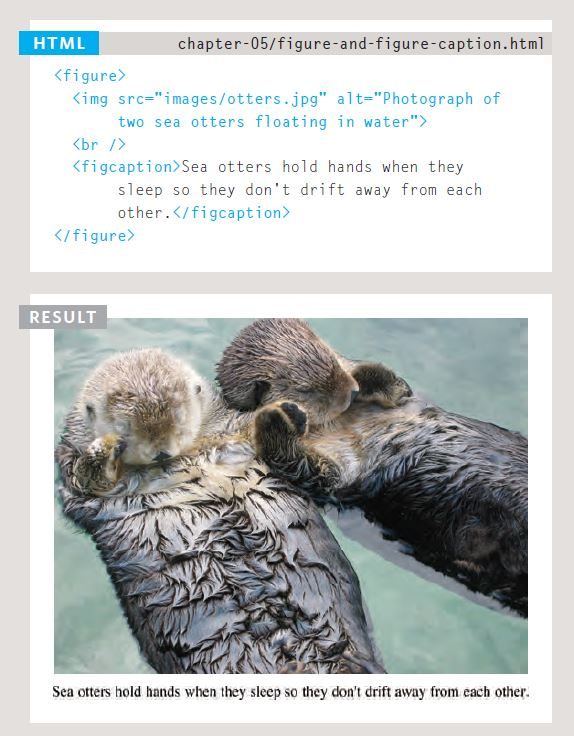

#### [Home](../README.md) | [Code 102](../102main.md) | [Code 201](../201main.md) | [Code 301](../301main.md) | [Code 401](../401main.md)
***
# Code 201 | Reading 5 - Images, Color, Text
***
## From the Duckett HTML book:
### Chapter 5: “Images” (pp.94-125)
- To best organize, create a separate folder that will hold all images
- Can also create subfolders for logos/buttons (interface), product images (product), etc.

To add an image, use the `` tag, and include the two attributes:
- `src` which tells the browser where to find the image. Can be a relative path if you're retrieving the image from your own site.
- `alt` which provides a text description of the image 

**Three Rules for Creating Images**
- Save the correct format: Use .jpg, .gif, .png formats. Other formats may make the page slower to load
    - Use .jpg for images with many differetn colors.
    - Use .gif or .png for images with few colors or large areas of the same color
- Save the right size: Use the same dimensions as you'll use on the site to avoid image distortion
- Save the correct resolution: Using a higher resolution than 72ppi may slow down the site

**Using the `<figure>` element**
The `<figure>` element is a new way to contain images and associate the images with a caption so they're associated with each other.

### Chapter 11: “Color” (pp.246-263)
Three ways to specify color in code:
1. RGB Values: Example - green is listed as `rgb(0, 255, 0)`
2. Hex Codes: Example - green is listed as `#00ff00`
3. Color Names: Example - green is listed simply as `green`

Also consider:
1. Hue
2. Saturation
3. Brightness

Ensure there is **contrast** so that your text is easy to read on the page

**Opacity** is introduced in CSS3 to specify the translucency/opacity of an element overlaid by another element

**HSL** is also new in CSS3 to specify values associated with *hue, saturation, and lightness*

### Chapter 12: “Text” (pp.264-299)
**Controlling appearance of text on your page by:**
1. Directly affecting the text's appearance (font family, font size, **bold**, *italic*, etc.)
2. Using code to impact the text regardless of the previous point

**PRIORITY SHOULD BE PLACED ON READABILITY**

**Font terminology**
- Serif fonts - typically have extra flourishes on the letters (Examples: Times New Roman, Georgia)
- Sans-serif fonts - much cleaner and have straighter edges (Examples: Arial, Verdana)
- Monospace fonts (or fixed-width fonts) - best for coding as each letter takes up the exact same amount of space (Examples: Courier, Fixed Sys)
- Weight - adds emphasis, such as **bold**
- Style - adds a cursive aspect
- Stretch - expands or compresses the width of the font, typically also making the letters lighter (if closer together) or more bold (if expanded)

**Ways to Specify Typefaces**
- `font-family` 
- `font-size` 
- `@font-face` 
- `font-weight` 
- `font-style` 
- `text-transform` 
- `text-decoration` 
- `line-height` 
- `letter-spacing` 
- `word-spacing` 
- `text-align` 
- `veritcal-align` 
- `text-indent` 
- `text-shadow` 
- `:first-letter` or `:first-line`  
- `:link` or `:visited`  
- `:hover`, `:active`, or `:focus` 

## Blog Post
[JPEG vs PNG vs GIF](https://blog.imagekit.io/jpeg-vs-png-vs-gif-which-image-format-to-use-and-when-c8913ae3e01d)

*NOTE: The post has a TL;DR you might find handy.*

***
#### [Home](../README.md) | [Code 102](../102main.md) | [Code 201](../201main.md) | [Code 301](../301main.md) | [Code 401](../401main.md)