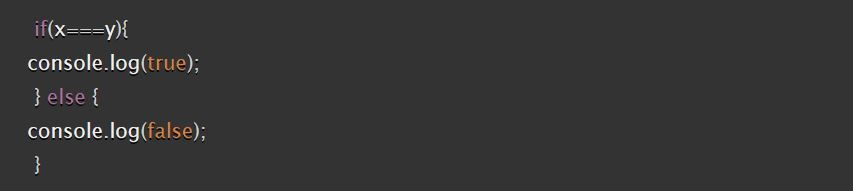

#### [Home](../README.md) | [Code 102](../102main.md) | [Code 201](../201main.md) | [Code 301](../301main.md) | [Code 401](../401main.md)
***
# Code 301 | Reading 4 - React and Forms
## Reading
[React Docs - Forms](https://reactjs.org/docs/forms.html)

**1. What is a "Controlled Component"?**

**2. Should we wait to store the users responses from the form into state when they submit the form OR should we update the state with their responses as soon as they enter them? Why?**

**3. How do we target what the user is entering if we have an event handler on an input field?**

[The Conditional (Ternary) Operator Explained](https://codeburst.io/javascript-the-conditional-ternary-operator-explained-cac7218beeff)

**1. Why would we use a ternary operator?**

**2. Rewrite the following statement using a ternary statement:**\

### Bookmark/Skim
- [React Bootstrap - Forms]()
- [React Docs - conditional rendering]()

***
#### [Home](../README.md) | [Code 102](../102main.md) | [Code 201](../201main.md) | [Code 301](../301main.md) | [Code 401](../401main.md)