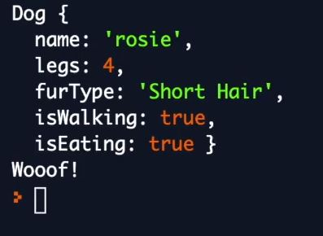
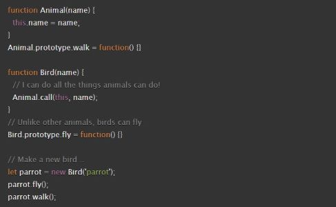

#### [Home](../README.md) | [Code 102](../102main.md) | [Code 201](../201main.md) | [Code 301](../301main.md) | [Code 401](../401main.md)
***
# ES6 Classes
- Watch the [Shred Talk: ES6 Classes](https://youtu.be/9Yc5J3Ap9-4)\
**Data Modeling** using **JS Constructor Functions and Prototypes** and **ES6 Classes**

#### Example:
- Person
    - Attributes: hair color, height, weight, location
    - Behaviors (verbs): walk(), speak(), drive()

```
const Animal = function (name, legs) {
    this.name = name;
    this.legs = legs;
    this.eat = function() {
        this.isEating = true;
    }
}
Animal.prototype.walk = function() {
    this.isWalking = true;
}

const Dog = function(name, legs) {
    Animal.call(this, name, legs);
    // this reflects the Dog being an Animal
}
Dog.prototype = Object.create(Animal.prototype);
// ^^ makes sure the Dog can do all of the things that an Animal can do

let puppy = new Animal('blake', 4);
puppy.walk();
puppy.eat();
console.log(puppy);
console.log(puppy instanceof Animal);
// results in 'true' because puppy is an instance of an Animal
console.log(puppy instanceof Dog);
// results in 'true' because puppy is an instance of a Dog
```


```
class Animal {
    constructor(name, legs) {
        this.name = name; 
        this.legs = legs;
    }

    walk() {
        this.isWalking = true;
    }
    eat() {
        this.isEating = true;
    }   
}

class Dog extends Animal {
    constructor(name, legs, furType) {
        super(name, legs);
        //super invokes the constructor on the parent class (in this case, Animal)
        this.furType = furType;
    }

    speak() {
        console.log('Woof!');
    }
}
// ^^^ a Dog is a type of Animal that is able to speak, and it speaks by saying 'Woof'

let rosie = new Dog('rosie', 4', 'Short Hair');
rosie.walk();
rosie.eat();
console.log(rosie);
rosie.speak();
```


- Review the [Demo Code](https://codefellows.github.io/code-301-guide/curriculum/prework/classes/DEMO.html) (oops, i did this while watching the video)
- Complete the [Assignment](https://codefellows.github.io/code-301-guide/curriculum/prework/classes/LAB.html)

## Objects and Inheritance
JavaScript objects use prototype-based inheritance. Its design is logically similar (but different in implementation) from class inheritance in strictly Object Oriented Programming languages like Java and C#.

It can be loosely described by saying that when methods or properties are attached to an object’s prototype, they become available for use on that object and its descendants, but not directly attached to them.

When you use `class` and `extends` keywords internally, JavaScript will still use prototype-based inheritance. It just simplifies the syntax (this is often called “Syntactic Sugar”). While classes are easier to use, it’s still very important to understand how prototype-based inheritance works. It’s still at the core of the language design.

### Prototypal Inheritance


### ES6 Classes
The same thing with classes (much cleaner!):
- `function()` becomes `class {}`
- `call()` becomes `extends`
- Classes are standalone, self-contained object (instance) factories
    - Ultimately, they result in a prototype
    - But for the developer, they are many orders of magnitude easier to comprehend and work with


### Additional Resources
- Video: [What the heck is the event loop anyway](https://www.youtube.com/watch?v=8aGhZQkoFbQ)
- [MDN inheritance](https://developer.mozilla.org/en-US/docs/Web/JavaScript/Inheritance_and_the_prototype_chain)
- [MDN this](https://developer.mozilla.org/en-US/docs/Web/JavaScript/Reference/Operators/this)
- [MDN class](https://developer.mozilla.org/en-US/docs/Web/JavaScript/Reference/Classes)

***
#### [Home](../README.md) | [Code 102](../102main.md) | [Code 201](../201main.md) | [Code 301](../301main.md) | [Code 401](../401main.md)