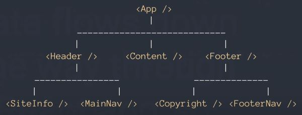

#### [Home](../README.md) | [Code 102](../102main.md) | [Code 201](../201main.md) | [Code 301](../301main.md) | [Code 401](../401main.md)
***
# A High Level Overview Of React

Watch this [short video](https://www.youtube.com/watch?v=FRjlF74_EZk) about React, then answer the questions below.

**What is React?**\
It is a library (not a framework with helper functions). It has a few functions for creating agnostic user interfaces.

**React is a User Interface: ____**\
Library. It's agnostic, which means it doesn't care where your user interface will display. It will be used to create interfaces (charts, search fields, websites, widgets, etc.). 

**How do we make a React element a DOM element?**\
We use ReactDOM to render the components in the page.

**What is a component?**\
A component is part of an architecture in an app such as headers, content, and footers that may also have sub-components to comprise the entirety of the application.

**What is the dataflow of React and which direction does the data flow?**\
Data only flows *down* one way through a React app. We can also control *where* the data is flowing, so we could pass the data only down to `<Header />` and `<Content />` but not pass it to `<Footer />`. We would use this by using parameters within the functions.

**Every component manages its own: ____**\
State, as well as passing it down to its child components.

***
#### [Home](../README.md) | [Code 102](../102main.md) | [Code 201](../201main.md) | [Code 301](../301main.md) | [Code 401](../401main.md)