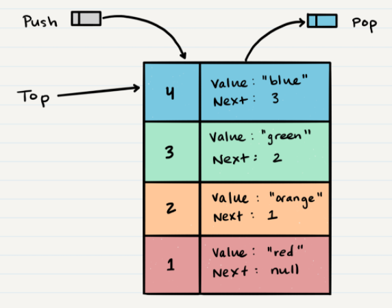
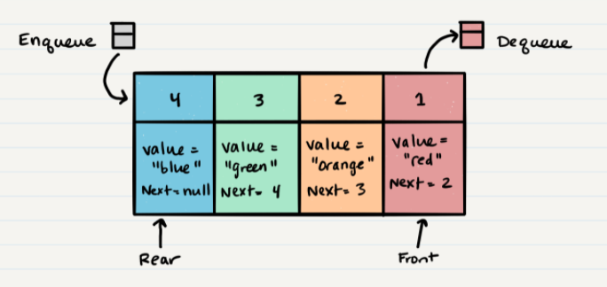

#### [Home](../README.md) | [Code 102](../102main.md) | [Code 201](../201main.md) | [Code 301](../301main.md) | [Code 401](../401main.md)

---

# Code 401 | Reading 10 - Stacks & Queues

Read article: [Stacks & Queues](https://codefellows.github.io/common_curriculum/data_structures_and_algorithms/Code_401/class-10/resources/stacks_and_queues.html)

## **What is a Stack?**

**Common Stack Terminology**

| Term     | Definition                                                                                                                          |
| -------- | ----------------------------------------------------------------------------------------------------------------------------------- |
| Push     | nodes or items that are put into the stack are pushed                                                                               |
| Pop      | nodes or items that are removed from the stack are popped; when you attempt to pop an empty stack an exception will be raised       |
| Top      | node at the top of the stack                                                                                                        |
| Peek     | peek allows you to view the value of the top node in the stack; when you attempt to peek an empty stack an exception will be raised |
| IsEmpty  | returns true when stack is empty otherwise returns false                                                                            |

**Queue Concepts**

-   **FILO** - **F**irst **I**n **L**ast **O**ut - first node/item added to the stack will be the last item popped out
-   **LIFO** - **L**ast **I**n **F**irst **O**ut - last node/item added to the stack will be the first item out
-   **Stack Visualization:**\
    
-   **Push O(1)**
    -   Pushing a node onto a stack will always be an O(1) operation, as it takes the same amount of time no matter now many nodes (n) you have
    -   To add a Node `push` it on to the stack by assigning it as the new top with its `next` property equal to the original top
-   **Pop O(1)**
    -   To `pop` a Node off the top of the stack, the `top` will be reassigned to the Note that lives below, and the `top` Node will be returned to the user
    -   Check for `isEmpty` prior to conducting a `pop` to avoid exceptions, or wrap in a try/catch block
-   **Peek O(1)**
    -   Use `peek` to ispect the `top` Node of the stack
    -   Check for `isEmpty` prior to conducting a `pop` to avoid exceptions, or wrap in a try/catch block
    -   Do not reassign the `next` property when we peek as we want to keep the reference to the `next` Node in the stack
-   **isEmpty O(1)** - checks for empty stack

---

## **What is a Queue?**

**Common Queue Terminology**

| Term     | Definition                                                                                                                          |
| -------- | ----------------------------------------------------------------------------------------------------------------------------------- |
| Enqueue  | Nodes or items that are added to the queue                                                                                          |
| Dequeue  | Nodes or items that are removed from the queue. If called when the queue is empty an exception will be raised                       |
| Front    | This is the front/first Node of the queue                                                                                           |
| Rear     | This is the rear/last Node of the queue                                                                                             |
| Peek     | When you peek you will view the value of the front Node in the queue. If called when the queue is empty an exception will be raised |
| IsEmpty  | returns true when queue is empty, otherwise returns false                                                                           |

**Stack Concepts**

-   **FIFO** - **F**irst **I**n **F**irst **O**ut - first item in the queue will be the first item out of the queue
-   **LILO** - **L**ast **I**n **L**ast **O**ut - last item in the queue will be the last item out of the queue
-   **Queue Visualization**:\
    
-   **Enqueue O(1)** - `enqueue` is used to add an item to the end of the queue with O(1) time use as it doesn't matter how many items live in the queue
-   **Dequeue O(1)** - `dequeue` is used to remove an item from the front of the queue with O(1) time use; use `isEmpty` or try/catch block to avoid exceptions
-   **Peek O(1)** - only inspects the `front` Node of the queue; use `isEmpty` or try/catch block to avoid exceptions
-   **IsEmpty O(1)** - checks for an empty queue

---

#### [Home](../README.md) | [Code 102](../102main.md) | [Code 201](../201main.md) | [Code 301](../301main.md) | [Code 401](../401main.md)
