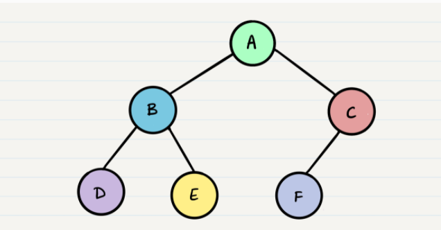
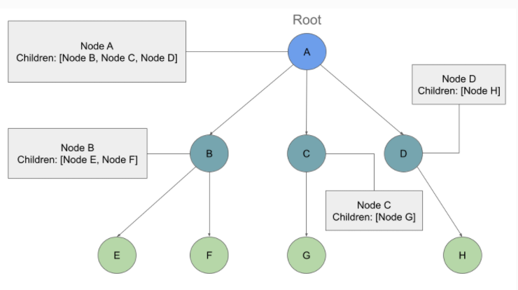
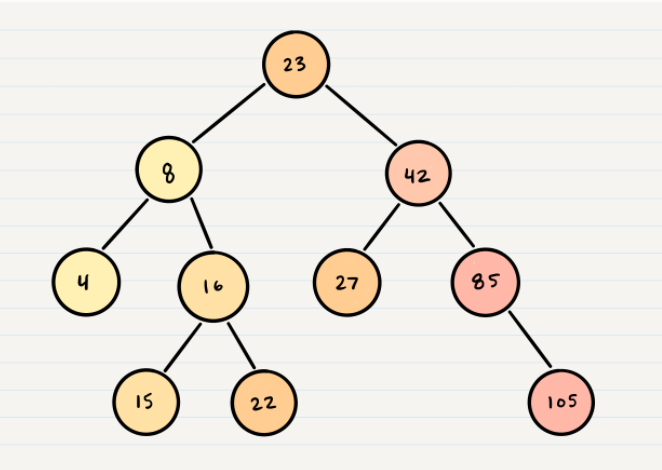
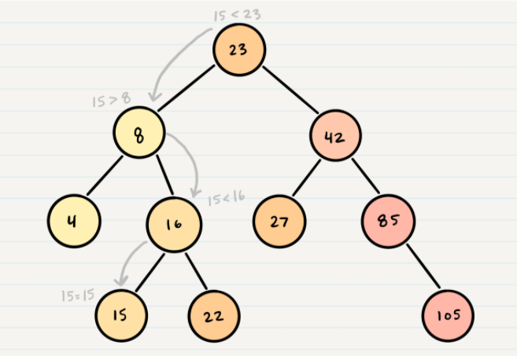

#### [Home](../README.md) | [Code 102](../102main.md) | [Code 201](../201main.md) | [Code 301](../301main.md) | [Code 401](../401main.md)

---

# Code 401 | Reading 15 - Trees

Read: [Trees](https://codefellows.github.io/common_curriculum/data_structures_and_algorithms/Code_401/class-15/resources/Trees.html)

## **Common Terminology**

| Term   | Definition                                                                                                         |
| ------ | ------------------------------------------------------------------------------------------------------------------ |
| Node   | A Tree node is a component which may contain it’s own values, and references to other nodes                        |
| Root   | The root is the node at the beginning of the tree                                                                  |
| K      | A number that specifies the maximum number of children any node may have in a k-ary tree. In a binary tree, k = 2. |
| Left   | A reference to one child node, in a binary tree                                                                    |
| Right  | A reference to the other child node, in a binary tree                                                              |
| Edge   | The edge in a tree is the link between a parent and child node                                                     |
| Leaf   | A leaf is a node that does not have any children                                                                   |
| Height | The height of a tree is the number of edges from the root to the furthest leaf                                     |

## **Traversals**

An important aspect of trees is how to traverse them. Traversing a tree allows us to search for a node, print out the contents of a tree, and much more! There are two categories of traversals when it comes to trees:

-   **Depth First**
-   **Breadth First**

### **Depth First**

Depth first traversal is where we prioritize going through the depth (height) of the tree first. There are multiple ways to carry out depth first traversal, and each method changes the order in which we search/print the root. Here are three methods for depth first traversal:



Given the sample tree above, our traversals would result in different paths:

-   _Pre-order_: `root >> left >> right`
-   _In-order_: `left >> root >> right`
-   _Post-order_: `left >> right >> root`

The most common way to traverse through a tree is to use **recursion**. With these traversals, we rely on the call stack to navigate back up the tree when we have reached the end of a sub-path.

```
function PreOrder(current) {
  console.log(current.value)

  if (current.left) {
    PreOrder(current.left);
  }
  if(current.right) {
    PreOrder(current.right);
  }
}

function InOrder(current) {
  if (current.left) {
    InOrder(current.left);
  }

  console.log(current.value);

  if(current.right) {
    InOrder(current.right);
  }
}

function PostOrder(current) {

  if (current.left) {
    PostOrder(current.left);
  }

  if(current.right) {
    PostOrder(current.right);
  }

  console.log(current.value);
}

```

### **Breadth First**

Breadth first traversal iterates through the tree by going through each level of the tree node-by-node. So, given our starting tree one more time:
\
Our output using breadth first traversal is now:

-   _Output_: `A, B, C, D, E, F`

Traditionally, breadth first traversal uses a queue (instead of the call stack via recursion) to traverse the width/breadth of the tree.

## Binary Tree Vs K-ary Trees

In all of our examples, we’ve been using a Binary Tree. Trees can have any number of children per node, but Binary Trees restrict the number of children to two (hence our `left` and `right` children).

## K-ary Trees

If Nodes are able have more than 2 child nodes, we call the tree that contains them a K-ary Tree. In this type of tree we use `K` to refer to the maximum number of children that each Node is able to have.

### Breadth First Traversal

Traversing a K-ary tree requires a similar approach to the breadth first traversal. We are still pushing nodes into a queue, but we are now moving down a list of children of length k, instead of checking for the presence of a left and a right child.

\
If we traversed this tree Breadth First we should see the output:

-   _Output_: `A, B, C, D, E, F, G, H`\

### Adding a node

Because there are no structural rules for where nodes are “supposed to go” in a binary tree, it really doesn’t matter where a new node gets placed.

One strategy for adding a new node to a binary tree is to fill all “child” spots from the top down. To do so, we would leverage the use of breadth first traversal. During the traversal, we find the first node that does not have all it’s children filled, and insert the new node as a child. We fill the child slots from left to right.

In the event you would like to have a node placed in a specific location, you need to reference both the new node to create, and the parent node upon which the child is attached to.

### Big O

The Big O time complexity for inserting a new node is `O(n)`. Searching for a specific node will also be `O(n)`. Because of the lack of organizational structure in a Binary Tree, the worst case for most operations will involve traversing the entire tree. If we assume that a tree has `n` nodes, then in the worst case we will have to look at `n` items, hence the `O(n)` complexity.

The Big O space complexity for a node insertion using breadth first insertion will be `O(w)`, where `w` is the largest width of the tree. For example, in the above tree, `w` is 4.

A “perfect” binary tree is one where every non-leaf node has exactly two children. The maximum width for a perfect binary tree, is `2^(h-1)`, where `h` is the height of the tree. Height can be calculated as `log n`, where `n` is the number of nodes.

## Binary Search Trees

A Binary Search Tree (BST) is a type of tree that does have some structure attached to it. In a BST, nodes are organized in a manner where all values that are smaller than the `root` are placed to the left, and all values that are larger than the `root` are placed to the right.

Here is how we would change our Binary Tree example into a Binary Search Tree:



### Searching a BST

Searching a BST can be done quickly, because all you do is compare the node you are searching for against the root of the tree or sub-tree. If the value is smaller, you only traverse the left side. If the value is larger, you only traverse the right side.

Let’s say we are searching `15`. We start by comparing the value `15` to the value of the root, `23`.

`15 < 23`, so we traverse the left side of the tree. We then treat `8` as our new “root” to compare against.

`15 > 8`, so we traverse the right side. `16` is our new root.

`15 < 16`, so we traverse the left side. And aha! `15` is our new root and also a match with what we were searching for.



The best way to approach a BST search is with a `while` loop. We cycle through the while loop until we hit a leaf, or until we reach a match with what we’re searching for.

### Big O

The Big O time complexity of a Binary Search Tree’s insertion and search operations is `O(h)`, or `O(height)`. In the worst case, we will have to search all the way down to a leaf, which will require searching through as many nodes as the tree is tall. In a balanced (or “perfect”) tree, the height of the tree is `log(n)`. In an unbalanced tree, the worst case height of the tree is `n`.

The Big O space complexity of a BST search would be `O(1)`. During a search, we are not allocating any additional space.

---

#### [Home](../README.md) | [Code 102](../102main.md) | [Code 201](../201main.md) | [Code 301](../301main.md) | [Code 401](../401main.md)
